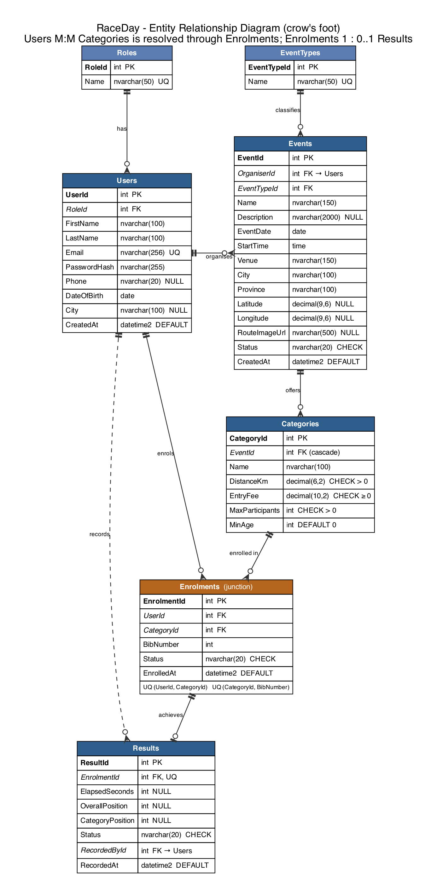
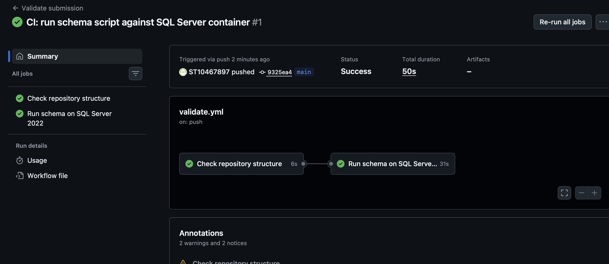

# RaceDay

RaceDay is an event management and participant tracking system for running, walking and cycling events in South Africa. Organisers publish events with one or more distance categories, participants enrol online and receive a bib number, and after race day organisers capture results that feed a public leaderboard and each participant's personal history.

This repository contains **Part 1** of the PROG6212 project: the database design, the API endpoint plan, the SQL script and the CI pipeline. No application code is included in Part 1; the ASP.NET Core Web API (Part 2) and the deployed web front end (Part 3) will be built on top of this design.

---

## Contents

1. [System description](#system-description)
2. [User roles](#user-roles)
3. [Repository structure](#repository-structure)
4. [Entity Relationship Diagram](#entity-relationship-diagram)
5. [API endpoint plan](#api-endpoint-plan)
6. [SQL script and SSMS setup](#sql-script-and-ssms-setup)
7. [ERD vs SQL differences](#erd-vs-sql-differences)
8. [Continuous integration](#continuous-integration)
9. [Video walkthrough](#video-walkthrough)
10. [Design decisions](#design-decisions)
11. [AI-use disclosure](#ai-use-disclosure)

---

## System description

RaceDay solves a common problem for community sports events: entries are collected on spreadsheets, bib numbers are handed out by hand, and results are posted as a PDF days later. RaceDay replaces that with one system where:

- **Organisers** create events (a marathon, a cycle tour, a coastal walk), define the categories for each event (42.2 km, 21.1 km, 10 km and so on, each with its own entry fee, participant limit and minimum age), see who has enrolled, and capture results after the event.
- **Participants** register, browse upcoming events by type, province or date, enrol in a category, view their upcoming enrolments and see their result history once results are captured.
- **Anyone** (no login) can browse published events and view the public leaderboard for a completed event.

Each event stores its venue coordinates so that Part 2 can display live weather for the event location, and a route image URL that will point to Azure Blob Storage in Part 3.

## User roles

| Role | Can do | Cannot do |
|---|---|---|
| **Organiser** | Create, edit and delete their own events and categories. View enrolments for their events. Record and correct results. | Enrol in events. Edit events created by another organiser. |
| **Participant** | Register and log in. Maintain their profile. Enrol in a category and cancel their own enrolment. View their enrolments and results. | Create events or categories. Record results. Cancel another participant's enrolment. |

Public registration always creates a **Participant**. Organiser accounts are seeded through the SQL script so that nobody can self-register as an organiser. See the [API endpoint plan](docs/api-endpoint-plan.md) for the full authorisation rules.

## Repository structure

```
RaceDay/
├─ .github/
│  └─ workflows/
│     └─ validate.yml          GitHub Actions: structure check + SQL Server run
├─ docs/
│  ├─ erd.png                  ERD image (crow's-foot notation)
│  ├─ erd.pdf                  ERD as PDF
│  ├─ erd.dbml                 ERD source (dbdiagram.io format)
│  ├─ erd.dot                  Graphviz source used to render erd.png / erd.pdf
│  ├─ api-endpoint-plan.md     Planned REST API (23 endpoints, six columns each)
│  ├─ raceday_schema.sql       Database creation + seed data + verification queries
│  └─ ci-green.png             Screenshot of a passing CI run
├─ README.md
└─ .gitignore
```

## Entity Relationship Diagram



Also available as [erd.pdf](docs/erd.pdf). The source is [erd.dbml](docs/erd.dbml), which can be pasted into [dbdiagram.io](https://dbdiagram.io) to view or re-export the diagram.

### Entities (7)

| Entity | Purpose | Key columns |
|---|---|---|
| **Roles** | Lookup: `Organiser`, `Participant` | `RoleId` PK, `Name` UNIQUE |
| **Users** | Every account in the system | `UserId` PK, `RoleId` FK, `Email` UNIQUE, `PasswordHash` |
| **EventTypes** | Lookup: `Running`, `Walking`, `Cycling` | `EventTypeId` PK, `Name` UNIQUE |
| **Events** | An event on a date at a venue, owned by one organiser | `EventId` PK, `OrganiserId` FK → Users, `EventTypeId` FK, `Latitude`, `Longitude`, `RouteImageUrl`, `Status` |
| **Categories** | A distance within an event, with fee, limit and minimum age | `CategoryId` PK, `EventId` FK (cascade), `DistanceKm`, `EntryFee`, `MaxParticipants`, `MinAge` |
| **Enrolments** | Junction table: a participant's entry into one category | `EnrolmentId` PK, `UserId` FK, `CategoryId` FK, `BibNumber`, UNIQUE (`UserId`, `CategoryId`) |
| **Results** | Outcome for one enrolment: finish time, positions, or DNF/DNS | `ResultId` PK, `EnrolmentId` FK UNIQUE, `RecordedById` FK → Users |

### Relationships

| Relationship | Cardinality | How it is enforced |
|---|---|---|
| Roles → Users | 1 : many | `FK_Users_Roles` |
| Users (organiser) → Events | 1 : many | `FK_Events_Users` |
| EventTypes → Events | 1 : many | `FK_Events_EventTypes` |
| Events → Categories | 1 : many | `FK_Categories_Events` with `ON DELETE CASCADE` |
| **Users ↔ Categories** | **many : many**, resolved through **Enrolments** | `FK_Enrolments_Users`, `FK_Enrolments_Categories`, `UQ_Enrolments_User_Category` |
| Enrolments → Results | 1 : 0..1 | `FK_Results_Enrolments` plus `UQ_Results_EnrolmentId` |
| Users (organiser) → Results | 1 : many (who recorded it) | `FK_Results_Users` |

The many-to-many relationship between Users and Categories is the heart of the design: a participant enrols in many categories over time, and a category has many participants. `Enrolments` resolves it and carries the attributes that belong to the pairing (bib number, status, enrolment date). `Results` hangs off `Enrolments` rather than off `Users` and `Categories` separately, so a result can never be attached to a participant who was not enrolled.

## API endpoint plan

The full plan is in [docs/api-endpoint-plan.md](docs/api-endpoint-plan.md). It describes 23 endpoints across six areas (authentication, profile, events, categories, enrolments, results) using six columns: method, route, purpose, role, request and responses. Every row lists the success code and every failure code with the condition that triggers it.

Highlights:

- JWT bearer authentication with a `role` claim.
- One standard JSON error shape for all failures.
- `401` means not logged in; `403` means wrong role or not the owner of the resource.
- `409 Conflict` is used for duplicate enrolments, full categories, duplicate results and deletes that would orphan enrolments, which mirrors the unique constraints and `NO ACTION` foreign keys in the database.

## SQL script and SSMS setup

[docs/raceday_schema.sql](docs/raceday_schema.sql) creates the `RaceDay` database from scratch, creates the seven tables in dependency order with named constraints, loads realistic seed data and finishes with verification queries.

### Seed data

| Table | Rows | Notes |
|---|---|---|
| Roles | 2 | Organiser, Participant |
| EventTypes | 3 | Running, Walking, Cycling |
| Users | 7 | 2 organisers, 5 participants |
| Events | 4 | Soweto Heritage Marathon, Cape Peninsula Cycle Tour, Durban Golden Mile Coastal Walk, and a completed Pretoria Jacaranda Half Marathon |
| Categories | 9 | 2–3 per event |
| Enrolments | 13 | Includes one cancelled enrolment |
| Results | 5 | 3 finishers, 1 DNF, 1 DNS for the completed event |

### Running it in SQL Server Management Studio

1. Open SSMS and connect to your SQL Server instance (LocalDB, SQL Express or a full instance all work).
2. **File → Open → File…** and select `docs/raceday_schema.sql`.
3. Press **F5** (Execute). The script drops any existing `RaceDay` database, recreates it, creates the tables, inserts the seed data and runs the verification queries. It takes a few seconds.
4. The **Results** pane shows four result sets:
   - row counts per table;
   - each event with its organiser, type and number of categories;
   - a full join of event → category → participant → enrolment → result;
   - the leaderboard for the completed Pretoria event.
5. The **Messages** pane ends with `RaceDay schema and seed data created successfully.`
6. Refresh **Object Explorer** to see `RaceDay` with its seven tables under **Tables**.

The script is safe to run repeatedly. Every run starts by dropping and recreating the database.

### Running it from the command line

```bash
sqlcmd -S localhost -U sa -P "<password>" -C -i docs/raceday_schema.sql
```

### Constraints in the script

- Every constraint is named with a prefix: `PK_`, `FK_`, `UQ_`, `CK_`, `DF_`.
- `NOT NULL` on all required columns; `UNIQUE` on `Users.Email`, `Roles.Name`, `EventTypes.Name`, `(Events.EventId, Categories.Name)`, `(UserId, CategoryId)` and `(CategoryId, BibNumber)` on Enrolments, and `Results.EnrolmentId`.
- `DEFAULT SYSUTCDATETIME()` on every `CreatedAt` / `EnrolledAt` / `RecordedAt` column.
- `CHECK` constraints: `DistanceKm > 0`, `EntryFee >= 0`, `MaxParticipants > 0`, `MinAge` between 0 and 120, latitude and longitude ranges, valid `Status` values on Events, Enrolments and Results, and a rule that a `Finished` result must have a time while `DNF`/`DNS` must not.
- `ON DELETE CASCADE` is used only on Events → Categories. All foreign keys to Users use `NO ACTION` to avoid SQL Server's "multiple cascade paths" error and to make the API return `409` instead of silently deleting enrolments and results.

## ERD vs SQL differences

There are **no differences** between the ERD and the SQL script. Both were produced from the same source and cross-checked table by table:

- All seven entities, all columns, data types and nullability match.
- Every primary key, foreign key, unique constraint and check constraint shown on the diagram exists in the script with the same name.
- The cascade rule on Events → Categories and the `NO ACTION` rule on every other foreign key are identical in both.

The only items that appear in the script but not on the diagram are the three non-unique indexes (`IX_Events_EventDate`, `IX_Events_OrganiserId`, `IX_Enrolments_CategoryId`), which are performance aids rather than part of the logical model.

## Continuous integration

[`.github/workflows/validate.yml`](.github/workflows/validate.yml) runs on every push and pull request. It has two jobs:

1. **Check repository structure** confirms that `docs/` contains the ERD (PNG or PDF), the `.dbml` source, `api-endpoint-plan.md` and a `.sql` file, and that `README.md` exists and contains a YouTube link.
2. **Run schema on SQL Server 2022** starts a `mcr.microsoft.com/mssql/server:2022-latest` service container, waits for it to accept connections, runs `raceday_schema.sql` with `sqlcmd` **twice** (the second run proves the script is re-runnable), and then checks that all seven tables exist with at least the minimum required seed rows.

A green run is evidence that the SQL script executes cleanly on a fresh SQL Server instance without any manual steps.



## Video walkthrough

Unlisted YouTube video (8–12 minutes) covering the system, the repository, the ERD, the endpoint plan, a live run of the SQL script in SSMS and the green CI run:

**https://youtu.be/REPLACE_WITH_VIDEO_ID**

## Design decisions

- **Custom Users table instead of ASP.NET Identity.** Identity creates its own `AspNetUsers` schema that would not match this ERD. A single `Users` table with a `PasswordHash` column keeps the ERD, the SQL and the JWT authentication in Part 2 aligned.
- **Organisers are seeded, not self-registered.** The register endpoint always creates a Participant. This prevents anyone from creating events without being vetted.
- **Enrolments as a proper junction entity with its own primary key.** A surrogate `EnrolmentId` makes Results a simple one-column foreign key, while `UNIQUE (UserId, CategoryId)` still prevents double entries.
- **Results are 1 : 0..1 from Enrolments.** A result only makes sense for someone who was enrolled, and there can only be one outcome per entry. The `UNIQUE` constraint on `Results.EnrolmentId` enforces this at the database level and the API surfaces it as `409`.
- **Bib numbers are unique per category, not globally.** Different categories in the same event commonly use different number ranges (1000s for the marathon, 2000s for the half), so the uniqueness rule is `(CategoryId, BibNumber)`.
- **Status columns as constrained strings.** `Events.Status`, `Enrolments.Status` and `Results.Status` use `NVARCHAR` with `CHECK` constraints rather than extra lookup tables. They are small fixed sets that the API maps to enums, and this keeps the ERD readable.
- **Forward-looking columns.** `Latitude` and `Longitude` on Events support the live-weather feature in Part 2, and `RouteImageUrl` will hold an Azure Blob Storage URL in Part 3. Adding them now avoids a schema change later.
